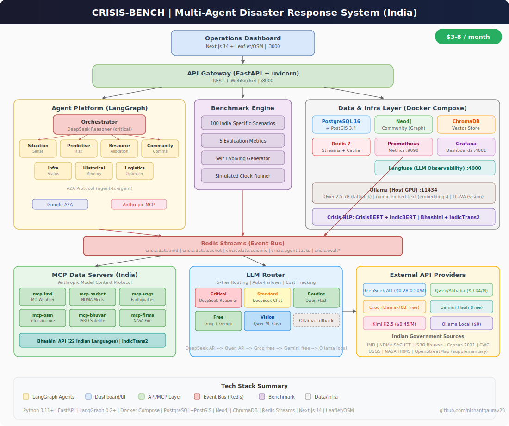

# CRISIS-BENCH (India)

**Multi-agent disaster response coordination system** with a self-evolving 100-scenario India-specific benchmark. 7 LLM specialist agents + orchestrator coordinate real-time disaster response using Indian government data sources.

**Hybrid LLM Strategy**: Chinese APIs (DeepSeek/Qwen) as primary + Groq/Gemini free tiers + Ollama local fallback. **Total cost: $3-8/month.**

---

## Architecture

<p align="center">
  
</p>

> The `.drawio` source is at [`docs/architecture.drawio`](docs/architecture.drawio) — open it in [draw.io](https://app.diagrams.net/) to edit.

---

## How It Works

```
Real-time data (IMD, NDMA, ISRO, USGS, NASA)
        │
        ▼
   MCP Data Servers ──► Redis Streams (Event Bus)
                              │
        ┌─────────────────────┼─────────────────────┐
        ▼                     ▼                      ▼
  Situation Sense      Predictive Risk        Resource Allocation
  Community Comms      Infra Status           Historical Memory
        │                     │                      │
        └─────────────────────┼──────────────────────┘
                              ▼
                    Orchestrator Agent
                    (DeepSeek Reasoner)
                              │
                              ▼
                  Coordinated Response Plan
                   + Dashboard (Next.js)
```

The **Orchestrator** (critical-tier LLM) coordinates 7 specialist agents, each handling a specific disaster response function. Agents communicate via **Google A2A** protocol over Redis Streams. Data flows in through **Anthropic MCP** servers connected to Indian government APIs.

---

## Key Features

- **7 Specialist Agents** — Situation Awareness, Predictive Risk, Resource Allocation, Community Communications, Infrastructure Status, Historical Memory, Logistics Optimization
- **100 India-Specific Scenarios** — Covering cyclones (Odisha, Gujarat), earthquakes (Himalayan belt), floods (Kerala, Bihar), landslides (Uttarakhand), heatwaves (Rajasthan), industrial disasters, GLOF events
- **Self-Evolving Benchmark** — LLM-generated scenarios that adapt based on agent performance gaps
- **5 Evaluation Metrics** — Situational Accuracy, Decision Timeliness, Resource Efficiency, Coordination Quality, Communication Appropriateness
- **India-First Data** — IMD weather, NDMA SACHET alerts, ISRO Bhuvan satellite, CWC river levels, Census 2011 demographics
- **5-Tier LLM Router** — Automatic routing by urgency with cost tracking and failover
- **22 Indian Languages** — via Bhashini API + IndicTrans2
- **Crisis NLP** — CrisisBERT + IndicBERT for social media analysis

---

## Tech Stack

| Layer | Technology | Cost |
|-------|-----------|------|
| Backend | Python 3.11+ / FastAPI / uvicorn | Free |
| Agent Framework | LangGraph 0.2+ | Free |
| Agent Protocols | Google A2A + Anthropic MCP | Free |
| LLM (Critical) | DeepSeek V3.2 Reasoner | $0.50/M tokens |
| LLM (Standard) | DeepSeek V3.2 Chat | $0.28/M tokens |
| LLM (Routine) | Qwen3.5-Flash | $0.04/M tokens |
| LLM (Vision) | Qwen3-VL-Flash | $0.10/M tokens |
| LLM (Free) | Groq (Llama-70B) + Gemini Flash | $0 |
| LLM (Local) | Ollama (Qwen2.5-7B) | $0 |
| Embeddings | nomic-embed-text via Ollama | $0 |
| Translation | Bhashini API + IndicTrans2 | $0 |
| Crisis NLP | CrisisBERT + IndicBERT | $0 |
| Event Bus | Redis Streams | Free |
| Vector DB | ChromaDB | Free |
| Graph DB | Neo4j Community | Free |
| Spatial DB | PostgreSQL 16 + PostGIS 3.4 | Free |
| Dashboard | Next.js 14 + Leaflet/OSM | Free |
| Optimization | Google OR-Tools + PuLP | Free |
| Monitoring | Prometheus + Grafana + Langfuse | Free |

---

## LLM Router — 5-Tier Routing

The LLM Router is the system's core innovation. It abstracts all providers behind a unified interface and routes calls based on urgency and cost.

| Tier | Provider | Cost | Use Case | Fallback Chain |
|------|---------|------|----------|---------------|
| **Critical** | DeepSeek Reasoner | $0.50/M | Evacuation decisions, cascading failures | Kimi K2.5 → Groq → Ollama |
| **Standard** | DeepSeek Chat | $0.28/M | Situation reports, infrastructure analysis | Qwen Flash → Groq → Ollama |
| **Routine** | Qwen Flash | $0.04/M | Classification, monitoring, summaries | Groq → Gemini → Ollama |
| **Vision** | Qwen VL Flash | $0.10/M | Satellite imagery analysis | Ollama LLaVA |
| **Free** | Groq / Gemini | $0 | Overflow, non-critical tasks | Ollama |

All providers expose OpenAI-compatible APIs — switching requires changing 2 env vars.

---

## Indian Data Sources (MCP Servers)

| Server | Source | Data |
|--------|--------|------|
| `mcp-imd` | India Meteorological Dept | District warnings, rainfall, cyclone tracking, AWS |
| `mcp-sachet` | NDMA SACHET CAP Feed | All-hazard alerts from 7 agencies + 36 states |
| `mcp-usgs` | USGS FDSNWS | Earthquake data covering India region |
| `mcp-osm` | OpenStreetMap Overpass | Hospitals, roads, shelters, infrastructure |
| `mcp-bhuvan` | ISRO Bhuvan | Satellite imagery, village geocoding, flood maps |
| `mcp-firms` | NASA FIRMS | Active fire detection, thermal anomalies |

---

## Quick Start

### Prerequisites

- Python 3.11+
- Docker & Docker Compose
- [Ollama](https://ollama.ai) (for local LLM fallback + embeddings)
- [uv](https://github.com/astral-sh/uv) (Python package manager)

### Setup

```bash
# Clone
git clone https://github.com/nishantgaurav23/crisis-bench.git
cd crisis-bench

# Copy environment config
cp .env.example .env
# Edit .env with your API keys (DeepSeek, Qwen, Groq, etc.)

# Install dependencies
make setup

# Start all Docker services (PostgreSQL, Redis, Neo4j, ChromaDB, etc.)
make infra

# Pull Ollama models (embeddings + fallback)
ollama pull qwen2.5:7b
ollama pull nomic-embed-text

# Initialize database schema
make db-init

# Run the system
make run
```

### Docker Services

```bash
docker-compose up -d    # Start all services
docker-compose ps       # Check status
```

| Service | Port |
|---------|------|
| PostgreSQL/PostGIS | 5432 |
| Redis | 6379 |
| Neo4j | 7474 / 7687 |
| ChromaDB | 8100 |
| Langfuse | 4000 |
| Prometheus | 9090 |
| Grafana | 4001 |
| API Gateway | 8000 |
| Dashboard | 3000 |
| Ollama | 11434 (host) |

---

## Project Structure

```
crisis-bench/
├── src/
│   ├── agents/              # 7 specialist agents + orchestrator
│   ├── protocols/
│   │   ├── a2a/             # Google A2A over Redis Streams
│   │   └── mcp/             # MCP servers for Indian data APIs
│   ├── benchmark/           # 100-scenario evaluation engine
│   ├── routing/             # 5-tier LLM router + cost tracking
│   ├── caching/             # ChromaDB plan caching + adaptation
│   ├── data/                # Ingestion, synthetic generation, NLP
│   ├── api/                 # FastAPI gateway + WebSocket
│   └── shared/              # Config, models, errors, telemetry
├── dashboard/               # Next.js + Leaflet (India map)
├── specs/                   # 55 spec folders (spec-driven dev)
├── tests/                   # Unit + integration tests
├── scripts/                 # Setup, ingestion, benchmark scripts
├── monitoring/              # Prometheus + Grafana configs
├── docker-compose.yml       # One command to start everything
└── roadmap.md               # Master development plan
```

---

## Development

This project follows **spec-driven development** with TDD (Red → Green → Refactor). 55 specs across 9 phases.

```bash
make test        # Run tests
make lint        # Run ruff linter
make benchmark   # Run benchmark suite
```

---

## Roadmap

| Phase | Name | Status |
|-------|------|--------|
| 1 | Project Bootstrap | Done |
| 2 | Shared Infrastructure | In Progress |
| 3 | API + Dashboard MVP | Pending |
| 4 | Communication Protocols | Pending |
| 5 | MCP Data Servers | Pending |
| 6 | Data Pipeline | Pending |
| 7 | Agent System | Pending |
| 8 | Benchmark System | Pending |
| 9 | Optimization & Polish | Pending |

---

## License

MIT

---

## Author

**Nishant Gaurav** — [github.com/nishantgaurav23](https://github.com/nishantgaurav23)
